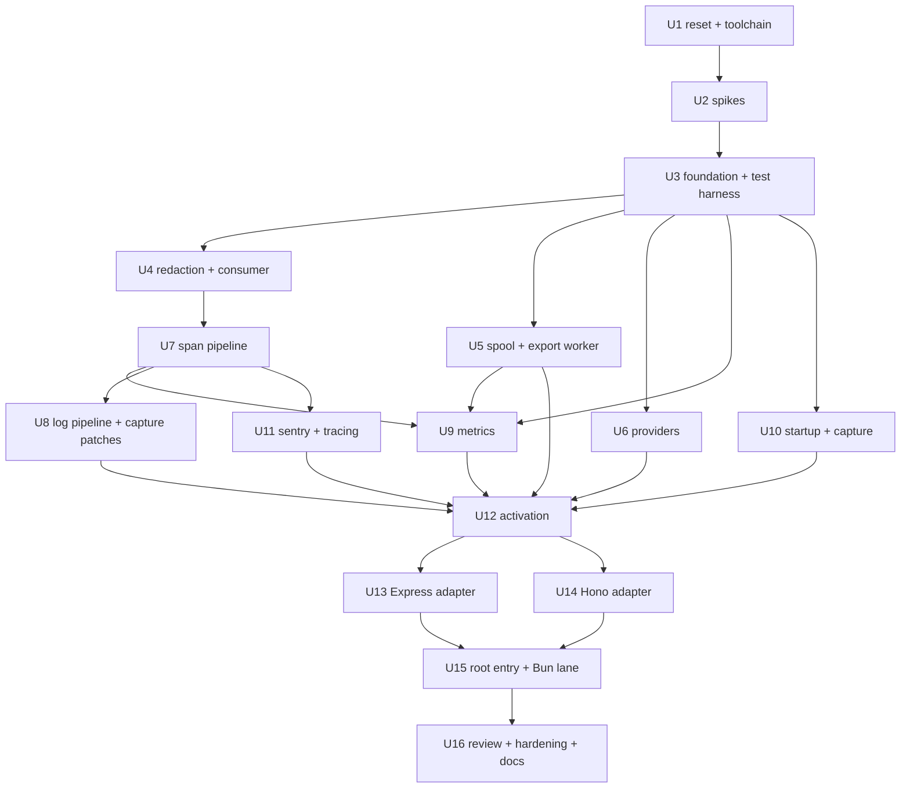

# Apitally JS SDK v1 Rewrite - Plan

## Goal Capsule

- **Objective:** rebuild the JS SDK as an OpenTelemetry distribution — shared core plus Express and Hono adapters — through the review-and-hardening phase (U16), fully tested and unreleased.
- **Authority hierarchy:** `v1/spec.md` > `v1/design.md` > `v1/design-js.md` (deviations D1-D7, verification spikes) > this plan. The Python SDK (`../apitally-py`) is the reference implementation; v0 code (git history, `main`) is the porting source. On conflict between a contract doc and implementation reality, stop and surface rather than improvise.
- **Stop conditions:** a spike result that contradicts a design decision beyond its recorded scope (update `design-js.md` first, then continue); anything requiring a product-scope change; a contract-doc conflict.
- **Execution profile:** work lands as commits on the `v1` branch, one module-with-its-tests per commit inside each unit. Nothing is published: no npm release, no publish workflow, no dist-tags. Cross-SDK verification via the `sdk-tests` harness is an external gate outside this plan.
- **Artifact lifecycle:** every markdown file in `v1/` (spec, design docs, this plan) is temporary and gets deleted before release. Code, tests, and code comments MUST NOT reference them — no spec/design section numbers, no D-numbers, no unit or KTD numbers. Every comment makes sense on its own against the code and its dependencies; only `AGENTS.md` and `README.md` survive as repo documentation.

---

## Product Contract

### Summary

Replace the v0 SDK with a v1 built on OpenTelemetry: the SDK produces spans, logs, and metrics through OTel pipelines, exports them via Apitally's spool-and-worker transport, and integrates with existing OTel setups instead of running beside them. Phase 1 ships the shared core and two adapters (Express, Hono); the remaining frameworks follow in later phases outside this plan.

### Requirements

**Core SDK**

- R1. The shared core implements `spec.md` and `design.md` semantics — span selection, sampling, per-request buffering, capture, redaction, logs, metrics, export pipeline, spool — with the JS deviations D1-D7 recorded in `design-js.md`.
- R2. One-line setup: `useApitally(app)` called in user code after imports, with first-request activation, and the SDK never breaks the app (design §12); no loader flags, no init-before-imports requirement.
- R3. Coexistence with user OTel setups: adopt an active SERVER span, attach to user-owned providers (OTel SDK >= 2.0, D1), keep meter/logger providers private, set RPC metadata and dedup nested SERVER spans (design-js §8).
- R4. Public API per design-js §13: root `useApitally` with duck-type dispatch, `setConsumer`, `setRequestAttribute`, `captureException`, `shutdown`, `instrument`/`span`, and `ApitallySpanProcessor` for hand-built OTel setups (D1 fallback) — all exported from the root entry.
- R5. Payload isolation and redaction MUSTs (spec §6.7, design §7): captured payloads never reach the live span or user exporters; a span that fails redaction is dropped, never exported raw.

**Adapters**

- R6. Express adapter (Express 4 and 5): `app.handle` wrap, route-template reconstruction, exception events, passive request-body tap, response observation, shutdown via server close.
- R7. Hono adapter (Hono >= 4) on Node and Bun: `app.fetch` wrap, `errorHandler` wrapping, 404 derivation, response stream teeing.
- R8. Root entry with duck-type framework detection plus per-framework subpath entries (`apitally/express`, `apitally/hono`).

**Quality and tooling**

- R9. Toolchain: Biome, strict tsc, tsup dual ESM+CJS (unbundled), attw-clean package shape, vitest — with CI jobs landing only alongside what they check (no placeholder jobs or exports-map entries).
- R10. Test suite per the conventions in design-js §16: two-tier layout, contract-derived scenarios with cited authority, deterministic (wall-clock sleeps and fake timers banned), exact-by-default assertions, Bun smoke suite, version matrix.
- R11. `AGENTS.md` carries the code style and test conventions from design §16 + design-js §16.
- R12. Nothing is released as part of this plan.

### Scope Boundaries

**Deferred to follow-up work**

- Phase 2: Fastify (hook-pair plugin, `onReady` activation, `onClose` shutdown, route from `routeOptions.url`; plugin packaging decided at phase start) and NestJS (rides Express/Fastify adapters; interceptor exception capture, Nest logger patch, decorator build flags restored). Per-phase mini design pass first.
- Phase 3: Koa (middleware + try/catch around `next()`), H3 v2 (plugin hooks per v0; confirm release status — v0 pins an RC), Hapi (`onPostStart`/`onPreStop`, Boom handling from v0).
- Phase 4: Elysia (Bun-primary, response-mapping wrap from v0) and AdonisJS (provider/middleware flow from v0; restores the tsup stub copy step).
- Releases: alpha/GA publishing, the npm publish workflow, and `MIGRATION.md` (0.x option mapping, removed APIs, the `captureLogs`/`env` default flips, per-framework before/after snippets).
- A `--import` auto-instrumentation entry point (D6 roadmap item, demand-driven).

**Outside this plan's identity**

- `sdk-tests` harness JS support — the end-to-end gate against the real cloud stack (spans, request logs, metrics, app logs, startup event, online status) lives there, in real harness apps; this repo ships no example apps.
- The `apitally-js-serverless` package (edge/serverless runtimes).

---

## Planning Contract

### Key Technical Decisions

Design-level decisions live in `design-js.md` (D1-D7) and are not restated here. Plan-owned decisions:

- KTD1. **No-placeholder sequencing.** Exports-map entries, CI jobs, and the root entry land only with their real files: `./express` in U13, `./hono` in U14, `"."` in U15; CI `check` starts as biome+tsc; `test`, `build`, and `coverage` join in U3; attw joins in U13 alongside the first exports-map entry, `test-bun` in U15, `test-matrix` in U16.
- KTD2. **Module-lands-with-test rhythm.** Each module commits together with its focused test module; module order within units is dependency order. Where a module's concrete peer lands later, it is written against interface types — OTel's where one exists, otherwise a small SDK-internal seam interface declared in the earlier unit's module — and wired centrally in `src/activation.ts` (U12).
- KTD3. **Unit clustering.** Units are cohesive module clusters sized for meaningful review, not per-module micro-units; the per-unit Files lists preserve the v0/Python porting map as the authority on provenance.
- KTD4. **Test conventions** (aligned decisions, recorded in design-js §16, enforced via `AGENTS.md`): two-tier layout; independent per-framework files with a cross-framework naming and ordering contract plus shared helpers; subject-predicate naming; lifecycle-arc ordering; contract-derived scenario selection with authority citations (Python suite mined as evidence, not authority); deterministic seams only; exact-by-default assertions.
- KTD5. **Port over rewrite.** Battle-tested v0 code is ported wherever shapes match; new code is written only where v1 semantics diverge (per-unit Files lists name the source).
- KTD6. **Spikes before code.** The seven design-js spikes run first (U2), timeboxed to hours each; results replace the spike section in `design-js.md`. Spikes 1 (provider attach internals) and 4 (`eventName` support) run first because they can change design details.
- KTD7. **Test suite as deliverable.** The suite is part of the product, not a byproduct of unit-by-unit verification. Coverage ownership: every behavior is asserted in exactly one home — the lowest layer that can observe it. `tests/shared/` owns core semantics; framework suites own adapter behavior, wiring, and the canonical cross-framework set, and never re-derive shared-core semantics beyond that set (the canonical set is the only sanctioned duplication — the same contract proven per framework). Two tests citing the same authority clause outside the canonical set is a defect. Helpers stay consolidated: one pipeline builder, one activation driver, one stub-server harness — extending an existing helper always beats adding a sibling. Enforced per commit via `AGENTS.md` and holistically at two audit gates (U12: shared suite; U16: full suite) with a shared acceptance bar: the suite reads as if designed in one sitting, and a reader cannot reconstruct this plan's unit boundaries from the tests.
- KTD8. **Code, naming, and comment rules** (digest of design §16; the JS derivation lands in `AGENTS.md`, modeled on the py `AGENTS.md`). Code: the least code that gets the job done, in modern idiomatic TypeScript within the Node >= 20.6.0 floor; modules read top-down (public entry points first, helpers after); no single-use helpers unless extraction meaningfully improves call-site readability; static imports at the top — optional peers resolve via synchronous `createRequire`, never static imports or dynamic `import()` (activation is synchronous); no unhandled rejections — async entry points (timer callbacks, event listeners, fire-and-forget sends) attach rejection handling; privacy by not exporting, no underscore prefixes. Naming: plain precise English, no invented shorthand or metaphors — a term qualifies only by referring to an actual thing in the codebase or its dependencies; a longer clear name over a compact clever one; vague verbs take an object or a from/to; boolean predicates read as questions (`is`/`should`/`has`); a name states what the function actually does including its outcome (`warnIfSamplerDropsSpans`, not `checkSampler`); one concept, one name across modules. Comments: sparse (one or two lines), stating only what the code cannot — a constraint, an external system's behavior, the reason for a choice — WHY, never WHAT; real component names, never metaphors; no historical references — nothing about v0, "previously", or "ported from", even though this plan's Files lists carry porting provenance; no references to the temporary `v1/` planning artifacts — no spec/design section numbers, D-numbers, unit or KTD numbers anywhere in code or tests (those docs are deleted before release; a comment that needs a rationale states the rationale itself). Testing: test only the SDK's own code — never pin what OTel or a framework does on its own; do not multiply a scenario into parameter variants (`it.each` is for genuine input tables); integration tests read responses to completion before asserting on exports; only full `npm run check` / `npm test` output counts as green.

### Unit dependency graph



Execution is sequential in unit-index order; the graph records verification dependencies, not a parallelization plan.

### Target repo structure

End state after U16. U1 deletes `eslint.config.js`, `scripts/`, `.github/workflows/publish.yaml`, and `.github/workflows/summary.yaml`; `v1/` is temporary per the artifact lifecycle. Unchanged root files (`LICENSE`, `renovate.json`, `.editorconfig`, `.gitignore`) omitted.

```
.github/workflows/
  tests.yaml            jobs: check (U1); test, coverage, build (U3); attw (U13);
                        test-bun (U15); test-matrix (U16); ci-gate (U1 — needs every
                        other job, if: always(), the single required status check)
AGENTS.md               U1
README.md               U16 rewrite
biome.json              U1
package.json            U1 rewrite; exports entries: ./express (U13), ./hono (U14),
                        . (U15)
tsconfig.json           U1
tsup.config.ts          U1 — all src/ modules as unbundled entries
vitest.config.ts        U1
v1/                     TEMPORARY — deleted before release

src/
  index.ts              U15  "." entry: duck-type dispatch + runtime re-exports
  activation.ts         U12  configure/activate/shutdown wiring hub
  config.ts             U3
  context.ts            U3
  internalLogger.ts     U3
  consumer.ts           U4
  redaction.ts          U4
  spool.ts              U5
  exportWorker.ts       U5
  providers.ts          U6
  spanProcessor.ts      U7
  exporter.ts           U7
  logPipeline.ts        U8
  logCapture.ts         U8   console/winston/pino patches in one module
  metrics.ts            U9
  startup.ts            U10
  capture.ts            U10
  sentry.ts             U11
  tracing.ts            U11
  express/              U13  "./express" entry
    index.ts
    middleware.ts
    routes.ts
  hono/                 U14  "./hono" entry
    index.ts
    middleware.ts
    routes.ts

tests/
  setup.ts              U3   global teardown-based isolation
  utils.ts              U3   pipeline builders, configureAndActivate, exporter patches
  stubOtlpServer.ts     U5   test infrastructure, not a test file
  index.test.ts         U15  root dispatch (src/index.ts is not a shared module)
  shared/               mirrors src/ 1:1 — one test module per source module
    internalLogger.test.ts config.test.ts   context.test.ts     redaction.test.ts
    consumer.test.ts    spool.test.ts       exportWorker.test.ts providers.test.ts
    spanProcessor.test.ts exporter.test.ts  logPipeline.test.ts logCapture.test.ts
    metrics.test.ts     startup.test.ts     capture.test.ts     sentry.test.ts
    tracing.test.ts     activation.test.ts
  express/              U13
    app.ts              uniform app fixture
    express.test.ts     integration: canonical set + full-chain smoke
    routes.test.ts      route reconstruction units
  hono/                 U14
    app.ts
    hono.test.ts
    routes.test.ts
  bun/
    hono.test.ts        U15  Bun smoke
```

### Sources

- Python suite structure and fixture model: `../apitally-py/tests/conftest.py` (autouse teardown resets, in-memory `exporters` fixture, `StubOTLPServer`), test philosophy in `../apitally-py/AGENTS.md`.
- v0 suite weaknesses motivating the determinism rules: wall-clock sleeps (600-1200ms) awaiting startup, `setImmediate` ordering waits, positional spy-arg assertions.
- Exponential histogram scale bounds accepted by ingest: [-2, 6] (`apitally_cloud/ingester/otlp_metrics.py` in the cloud repo); JS `sdk-metrics` exposes no scale knob, hence the downscale in U9.

---

## Implementation Units

| U-ID | Title | Phase | Key files | Depends on |
|---|---|---|---|---|
| U1 | Repo reset and toolchain | 0 | `package.json`, `biome.json`, CI workflows, `AGENTS.md` | — |
| U2 | Verification spikes | 1a | `design-js.md` (spike outcomes) | U1 |
| U3 | Foundation and test harness | 1b | `src/internalLogger.ts`, `src/config.ts`, `src/context.ts`, `tests/setup.ts`, `tests/utils.ts` | U2 |
| U4 | Redaction and consumer | 1b | `src/redaction.ts`, `src/consumer.ts` | U3 |
| U5 | Spool and export worker | 1b | `src/spool.ts`, `src/exportWorker.ts`, `tests/stubOtlpServer.ts` | U3 |
| U6 | Providers | 1b | `src/providers.ts` | U3 |
| U7 | Span pipeline | 1b | `src/spanProcessor.ts`, `src/exporter.ts` | U4 |
| U8 | Log pipeline and capture patches | 1b | `src/logPipeline.ts`, `src/logCapture.ts` | U7 |
| U9 | Metrics | 1b | `src/metrics.ts` | U3, U5, U7 |
| U10 | Startup event and capture helpers | 1b | `src/startup.ts`, `src/capture.ts` | U3 |
| U11 | Sentry and manual tracing | 1b | `src/sentry.ts`, `src/tracing.ts` | U7 |
| U12 | Activation orchestration | 1b | `src/activation.ts` | U5, U6, U8, U9, U10, U11 |
| U13 | Express adapter | 1c | `src/express/*.ts` | U12 |
| U14 | Hono adapter | 1d | `src/hono/*.ts` | U12 |
| U15 | Root entry and Bun lane | 1d | `src/index.ts`, `tests/bun/` | U13, U14 |
| U16 | Review, hardening, docs | 1e | CI `test-matrix`, `README.md` | U15 |

### U1. Repo reset and toolchain

- **Goal:** one commit that resets the repo for v1; v0 stays reachable via git history and `main` for porting reference.
- **Requirements:** R9, R11, R12.
- **Files:** delete `src/`, `tests/`, `eslint.config.js`, and `scripts/`; rewrite `package.json`; add `biome.json`; adapt `tsconfig.json` (strict, ES2022, NodeNext; drop decorator flags until the NestJS phase), `tsup.config.ts` (drop the stub copy step until the Adonis phase), `vitest.config.ts` (drop swc/decorators until NestJS); keep Renovate config; rewrite `.github/workflows/` to a single `tests.yaml` (delete `publish.yaml` and `summary.yaml`); author `AGENTS.md`.
- **Approach:** `package.json` gets `engines: {"node": ">=20.6.0"}`, `sideEffects: false`, dependencies per design-js §14/§16 (OTel stable `^2.9.0`/api `^1.9.0`, experimental `^0.220.0`, `instrumentation-undici` `^0.30.0`, undici; optional peers: express, hono, winston, pino, `@sentry/node`); the exports map starts empty and grows per KTD1. Scripts: `check` (biome + tsc), `test` (vitest), `build` (tsup, all `src/` modules as unbundled entries — the exports map independently governs the public surface per KTD1), package-shape check via attw. CI `check` job runs biome+tsc only; `tests.yaml` is modeled on the py workflow and ends in a `ci-gate` job (`needs` every other job, `if: always()`, fails on any failure or cancellation) as the single required status check — jobs join the gate as they land per KTD1. Coverage is flag-gated, never forced on in config (v0 weakness). `AGENTS.md` is authored from design §16 + design-js §16, modeled on the Python `AGENTS.md`: the KTD8 code, naming, and comment rules plus the finer-grained py rules (renaming a function renames its associated constants; public API names stay stable; a comment sits next to the code it justifies and stays accurate), the no-references-to-planning-artifacts rule (the `v1/` docs are deleted before release; comments stand alone), no `instanceof` across OTel package copies, the test philosophy (every test pins a spec MUST, a settled design decision, or a plausible regression; mock only at process boundaries; one end-to-end test over several micro-tests), the test conventions from KTD4, the coverage-ownership rule from KTD7 (one behavior, one home; extend an existing helper over adding a sibling), the sleep/fake-timer ban, and the check/test commands.
- **Test scenarios:** none — pure toolchain and scaffolding; the pipeline proves itself green on U3's first real module.
- **Verification:** `npm run check` green on the empty skeleton (tsconfig includes the root `*.config.ts` files so tsc has inputs before U3); CI `check` job green; `AGENTS.md` review against design §16 + design-js §16.

### U2. Verification spikes

- **Goal:** resolve the seven design-js spikes as throwaway scripts plus notes; record outcomes in `design-js.md` (spike section replaced with results).
- **Requirements:** R1, R3 (spikes de-risk D1, D2 timing, metrics, Sentry).
- **Dependencies:** U1.
- **Files:** scratch scripts (uncommitted); `v1/design-js.md` edits.
- **Approach:** timebox each to hours. Order: spike 1 (OTel 2.x provider attach internals incl. `NodeSDK`-built providers) and spike 4 (`sdk-logs` native `eventName` support) first — both can change design details. Then: 2 (batch processor config precedence over env vars), 3 (otlp-transformer byte-stability + gzip determinism + bytes-attribute serialization on export copies), 5 (exponential histogram downscale correctness; delta via reader selectors with gauges unaffected), 6 (`instrumentation-undici` under `suppressTracing` and the proxy dispatcher), 7 (Sentry client access per major: carrier walk vs peer-resolved `getClient()`; record chosen path and supported major range in design-js §14).
- **Test scenarios:** none — spike outcomes become design facts that U3-U15 test scenarios then pin.
- **Verification:** design-js spike section replaced with dated outcomes; any design-detail changes applied to the affected sections.

### U3. Foundation and test harness

- **Goal:** the three dependency-root modules plus the global test infrastructure; CI `test`, `build`, and `coverage` jobs join `check` here.
- **Requirements:** R1, R2, R9, R10.
- **Dependencies:** U2.
- **Files:** `src/internalLogger.ts` (new, ~20 lines), `src/config.ts` (ported from py `shared/config.py`; v0 `common/paramValidation.ts`), `src/context.ts` (ported from py `shared/context.py` + `consumer.py` holder), `tests/shared/internalLogger.test.ts`, `tests/shared/config.test.ts`, `tests/shared/context.test.ts`, `tests/setup.ts`, `tests/utils.ts`, CI workflow edits.
- **Approach:** `internalLogger.ts` is the console-backed SDK-diagnostics logger — warnings and errors always emit, debug output only under `APITALLY_DEBUG` — with warn dedup (design §12; design-js §12). `config.ts` carries `ApitallyOptions`, env-var resolution, validation, and first-call-wins/re-call semantics (design §3), plus the content-type allowlist (spec §6.3) and default pattern tables (spec §6.7/§6.8); a missing or format-invalid write token logs an error with the token masked to a short prefix and force-disables the SDK (design §3, §12 credential invariant). `context.ts` holds the request-scoped holders (span handle, per-request record, consumer holder) and context keys. `tests/setup.ts` implements the isolation contract from design-js §16: global `afterEach` teardown resets for OTel API globals, the config singleton, env vars, and patches — tests never pre-clean (Python conftest model). `tests/utils.ts` starts with in-memory pipeline builders and force-flush read helpers (`exportedSpans`, `expectSingle`), growing as later units need drivers; it also carries a `configureAndActivate` helper that clears the test-runner markers (`VITEST`, `JEST_WORKER_ID`, `NODE_ENV`) before driving configure/activate and asserts activation succeeded (py conftest `configure_and_activate` parity; the global teardown restores env). Integration suites follow the py `exporters` fixture model, adapted to ESM: the spool-exporter factories are replaceable properties on a small factory object (ESM module namespaces are immutable and `bun test` has no vitest-style module mocking, so py-style module patching does not port); tests swap them so real activation constructs in-memory exporters and the worker performs no I/O; the global teardown restores them.
- **Test scenarios:**
  - config resolves option > env var > default precedence per option (design §3)
  - invalid option values resolve per option — an invalid `sampleRate` silently resolves to capture-everything, invalid patterns are dropped individually with an error log while remaining patterns stay in effect — table-driven via `it.each` (design §3; py parity)
  - a missing or format-invalid write token logs an error with the token masked to a short prefix, never verbatim, and force-disables the SDK (design §3, §12 credential invariant)
  - a second `configure` call keeps first-call-wins semantics (design §3)
  - `OTEL_SDK_DISABLED` disables the SDK, parsing the same truthy values as `APITALLY_DISABLED`, with option-over-env precedence (design §3)
  - omitted options stay `undefined` and keep env-var fallbacks in effect (design-js §3)
  - content-type allowlist admits and rejects per the table, `it.each` (design §7; py parity)
  - internal logger warnings and errors always emit and repeated warnings deduplicate; debug output appears only when `APITALLY_DEBUG` is set (design §12; design-js §12)
  - span-handle and consumer holders resolve inside a request context and are empty outside it (design §13; py parity — JS `AsyncLocalStorage` semantics)
- **Verification:** first real modules green through the full pipeline: `npm run check`, `npm test`, `npm run build`, CI `coverage` job green.

### U4. Redaction and consumer

- **Goal:** the data-hygiene primitives used by the export path and public API.
- **Requirements:** R1, R5.
- **Dependencies:** U3.
- **Files:** `src/redaction.ts` (ported from py `shared/redaction.py`; v0 `common/requestLogger.ts` masking), `src/consumer.ts` (ported from v0 `common/consumerRegistry.ts` `consumerFromStringOrObject`; py `shared/consumer.py`), `tests/shared/redaction.test.ts`, `tests/shared/consumer.test.ts`.
- **Approach:** redaction engine covers query params, headers, and JSON body fields with defaults plus user patterns and `[REDACTED]` semantics (spec §6.7); the JSON walker masks nested fields. Consumer core enforces identifier/name/group caps and trimming (spec §6.2; design §13).
- **Test scenarios:**
  - default and user-configured query params are masked in URL-bearing attributes across both semconv normalizations (spec §6.7; design §7)
  - list-valued headers redact to a single `[REDACTED]` value; `Location`/`Content-Location` get query redaction (design §7)
  - nested JSON body fields matching mask patterns are masked, non-matching siblings untouched (spec §6.7; py parity)
  - non-UTF-8 bodies skip field redaction and pass through as bytes (design §7)
  - consumer identifier/name/group are trimmed and length-capped; invalid identifiers are dropped (spec §6.2; design §13; v0 parity)
- **Verification:** module suites green; redaction behavior re-verified end-to-end in U7's export-copy tests.

### U5. Spool and export worker

- **Goal:** the offline transport — spool files with caps/retention plus the send-cycle worker — and the stub OTLP server test infrastructure.
- **Requirements:** R1.
- **Dependencies:** U3.
- **Files:** `src/spool.ts` (ported from v0 `common/tempGzipFile.ts` mechanics; py `shared/spool.py` semantics), `src/exportWorker.ts` (ported from py `shared/export.py`; v0 `common/client.ts` fetch patterns), `tests/shared/spool.test.ts`, `tests/shared/exportWorker.test.ts`, `tests/stubOtlpServer.ts` (node:http, gzip protobuf capture, protobuf decoding via devDependency, scriptable responses including `Apitally-Export-Interval`).
- **Approach:** spool per design §10: per-signal `apitally-*.gz` files in `os.tmpdir()`, created with mode `0o600` and the exclusive-create flag (py `tempfile` parity), failing through the writability-probe/memory-fallback path; 4 MB uncompressed rotation checked before append, bounded sub-chunk appends, 50 MB disk / 10 MB memory caps with metrics-last eviction, 59-minute retention after first send attempt, 2-hour orphan cleanup, per-cycle mtime touch, synchronous writability probe with in-memory fallback. Worker per design §10: the send cycle is a directly callable method (KTD4 determinism seam) scheduled on one unref'd timer (15s ±10% jitter, first ~2s); 10 files per cycle oldest-first, inter-send pauses, 10s POST timeout via `AbortSignal.timeout` (injectable for tests), retry classification, `Apitally-Export-Interval` clamping, cycles under `suppressTracing`, uncapped unpaced final drain; proxy via undici `EnvHttpProxyAgent` as per-request dispatcher only when proxy env vars are present (Node), native `proxy` option on Bun.
- **Test scenarios:** (spool tests run against both disk and memory backends, py parity)
  - rotation occurs at the 4 MB uncompressed threshold, checked before append (design §10)
  - the size cap evicts oldest non-metrics files first (design §10; py parity)
  - files older than retention after first send attempt are dropped; orphans older than 2h are cleaned, driven by mtime manipulation (design §10; py parity)
  - an unwritable temp dir falls back to memory (design §10; py parity)
  - created spool files have mode 0600 (py `tempfile` parity)
  - an export cycle posts all three signals in lockstep with correct headers (`Authorization`, `Apitally-Env`, `Content-Type`, `Content-Encoding`, `User-Agent`) (spec §2-§4; design §10; design-js §10)
  - a failed send retries next cycle with byte-identical payload, protobuf-decoded (design §10; py parity)
  - during an outage one probe per cycle is sent without unbounded file accumulation, and data is delivered byte-identical after recovery (design §10; py parity)
  - permanent 4xx drops the file with a once-per-status warning; 408/429/5xx/connection errors are retryable, with one immediate inline re-POST on connection error (design §10; spec §10 status table)
  - the `Apitally-Export-Interval` response header adjusts the interval, clamped to [5, 60] (design §10)
  - a hung POST aborts at the injected timeout (design §10)
  - jitter and pacing values stay within design bounds, tested as pure functions (design §10)
  - the worker timer is unref'd (design-js §4 — JS-only)
- **Verification:** module suites green including the stub-server round-trips with decoded protobuf assertions.

### U6. Providers

- **Goal:** resource construction plus tracer/meter/logger provider setup for both the no-provider and user-provider paths.
- **Requirements:** R1, R3.
- **Dependencies:** U3 (spike 1 informs D1 attach shapes).
- **Files:** `src/providers.ts` (ported from py `shared/providers.py`), `tests/shared/providers.test.ts`.
- **Approach:** per design-js §2: detection via the OTel proxy delegate (never `instanceof`); no-provider path constructs `NodeTracerProvider` with always-on sampler, registers it globally, registers `AsyncLocalStorageContextManager` and the W3C propagator each only when unset, and pins attribute value length limits to 65,536 on `generalLimits` and `spanLimits`; user-provider path attaches `ApitallySpanProcessor` through the internal processor list with defensive shape checks (D1, per spike 1), reads the provider's public `resource` property for env resolution, and warns once when unrecognized, instructing to add the root-exported `ApitallySpanProcessor` to the provider's `spanProcessors`. Resource built once per design §2/spec §5.
- **Test scenarios:**
  - with no user provider, the SDK registers its provider as the OTel global with an always-on sampler (design §2)
  - context manager and propagator are registered only when unset; pre-registered ones are left untouched (design-js §2 — JS-only)
  - attribute length limits are pinned so an `OTEL_ATTRIBUTE_VALUE_LENGTH_LIMIT` env var never clips captured bodies (design-js §2 — JS-only)
  - the resource carries `service.instance.id` (UUIDv4), `deployment.environment.name`, and the distro name/version pair (spec §5)
  - with a user-owned 2.x provider, the processor is attached additively and the user's exporters keep receiving their spans (D1; py parity)
  - with a user-owned provider, the env resolves from its resource's `deployment.environment.name` when present; a conflicting configured env warns once and the resource value wins (design §2)
  - an unrecognized provider shape warns once with the actionable `spanProcessors` fix (D1)
  - a user provider with a recognizably span-dropping sampler (always-off, ratio-based, or parent-based on such a root) warns once naming the coverage consequence; unrecognized custom samplers stay silent (design §2)
  - an adopted provider whose effective attribute length limit is below 65,536 warns once when a capture option is enabled (design §2)
  - meter and logger providers are never registered into OTel globals (design §2)
- **Verification:** module suite green.

### U7. Span pipeline

- **Goal:** the request engine — span processor (in-flight map, classification, sampling, buffering, release) and exporter (export-copy construction with capture payloads and redaction).
- **Requirements:** R1, R3, R5.
- **Dependencies:** U4.
- **Files:** `src/spanProcessor.ts` (ported from py `shared/span_processor.py`, minus deferral per D2), `src/exporter.ts` (ported from py `shared/exporter.py`), `tests/shared/spanProcessor.test.ts`, `tests/shared/exporter.test.ts`.
- **Approach:** per design §5-§6 and D2: in-flight map keyed by SERVER span id is the single keep/drop point; classification at span start; children inherit their local parent's entry; lookup miss defaults to dropped. Release condition: transport completion AND SERVER-span end, whichever second. The write-through helper mirrors attribute writes into the per-request record; capture payloads are stash-only and reach only Apitally's export copy (design §7). Nested-SERVER dedup per design-js §8: bind to the same entry, demote to INTERNAL on the export copy, warn once naming the producing scope.
- **Test scenarios:**
  - nothing is exported before both release conditions hold; whichever of transport completion and span end comes second triggers release (D2)
  - non-SERVER local roots and their children are dropped; in-flight map miss means dropped (design §5; py parity)
  - OPTIONS, websocket-scheme, and path/user-agent-excluded requests drop spans at start (design §5; spec §6.5/§6.8; py parity)
  - when the producing instrumentation omits path attributes, path and query are derived from the full-URL attribute at span start and written onto the span (design §5)
  - sampling is deterministic by trace id, both stages test the same value, overall probability is the minimum (design §6; py parity)
  - response-stage sampling keeps errors and drops healthy requests (design §6; py parity)
  - a throwing, invalid-returning, or Promise-returning sampling callback warns and resolves to keep (design §6; design-js §6 — callbacks are synchronous)
  - per-request span buffers cap at 1,000 spans (design §6)
  - a late descendant follows its request's keep/drop decision (design §6; py parity)
  - contrib per-message send/receive spans are dropped while user socket spans are kept (spec §6.6; py parity)
  - a nested SERVER span under an in-flight request binds to the same entry, exports as INTERNAL on Apitally's copy, and warns once (design-js §8 — JS-only)
  - processor shutdown releases transport-complete requests and discards in-flight buffers (design §6)
  - capture payloads never appear on the live span: a second exporter on the same provider sees none of them (design §7 MUST)
  - the export copy applies the request record idempotently; late-learned attributes reach the exported span (design §6)
  - `setRequestAttribute` writes reach the live span and the export copy through the write-through helper; `captureException` records the exception event, coercing non-Error values; both are safe no-ops outside a request (design-js §13; design §12)
  - a consumer set in the holder before SERVER-span start is written onto the span at start (design §13; design-js §13)
  - mask callbacks returning nothing, throwing, or returning a wrong type yield `[REDACTED]` (design §7)
  - a span whose redaction fails is dropped, never exported raw (design §7)
  - body processing order is mask → parse → redact → serialize; a stashed `[BODY_TOO_LARGE]` sentinel bypasses the pipeline and exports unchanged (design §7)
  - pre-compressed (gzip) response bodies pass through to the export copy as bytes without decompression (design §7)
- **Verification:** module suites green; the payload-isolation scenario doubles as the review gate for D2's write-through helper.

### U8. Log pipeline and capture patches

- **Goal:** the private log pipeline plus the console/winston/pino capture patches (D4).
- **Requirements:** R1, R5.
- **Dependencies:** U7 (request linkage uses the in-flight map).
- **Files:** `src/logPipeline.ts` (ported from py `shared/log_processor.py`), `src/logCapture.ts` (one module for all three patches — console and winston ported from v0 `loggers/{console,winston}.ts`, pino new via shared prototype write patch on `pino.symbols.writeSym` from a probe instance; shared severity mapping and emit helpers live beside their callers), `tests/shared/logPipeline.test.ts`, `tests/shared/logCapture.test.ts` (one `describe` per library).
- **Approach:** per design §9/D4: patches emit into the private `LoggerProvider` through `api-logs` with severity mapping per spec §8 and instrumentation scope = logger name (`console` for console); winston and pino are peer-resolved via synchronous `createRequire` (design-js §16) so the user's copy is patched under strict layouts (pnpm). Request linkage, drop rule, self-log exclusion, buffering, and 2,048-char truncation per design §9. Code-location attributes omitted (D7).
- **Test scenarios:**
  - a log emitted inside a request carries the request linkage and follows the request's keep/drop decision (spec §8; design §9; py parity)
  - a log record emitted outside any request is dropped; `apitally`-scoped records are exempt from the drop rule and from truncation (spec §8; design §9)
  - a request's log buffer caps at 1,000 records (design §6)
  - SDK-internal and OTel diagnostic logs are never captured (design §9; py parity)
  - log bodies truncate at 2,048 characters (design §9)
  - console method wraps map severities per spec §8 with scope `console` (spec §8; design-js §9)
  - a winston logger created before `useApitally` is captured via the prototype patch (D4 — the contrib-gap rationale)
  - pino loggers created before and after `useApitally` are both captured via the `writeSym` prototype patch (D4 — JS-only)
  - patches are idempotent across double `useApitally` and safe when the library is absent (design §3 re-call semantics; design §12)
  - captured logs reach only the private provider: a user-registered global logger provider receives none of them (design §2/§9 — pins the privacy invariant)
- **Verification:** module suites green against the devDependency-pinned winston and pino versions.

### U9. Metrics

- **Goal:** request histograms, process gauges, the non-periodic reader, and the exponential-histogram downscale.
- **Requirements:** R1.
- **Dependencies:** U3, U5, U7 (spike 5 informs the downscale and selector behavior; U5's stub server carries the decoded-protobuf verification; U7's release machinery drives the recording scenarios).
- **Files:** `src/metrics.ts` (ported from py `shared/metrics.py`; v0 `common/resources.ts` gauges), `tests/shared/metrics.test.ts`.
- **Approach:** per design §11/spec §7: three request histograms under scope `apitally`, exponential buckets, delta temporality via reader selectors scoped to histogram instruments; recorded at transport completion from the per-request record, independent of span-end timing and sampling. Downscale exponential data points to scale <= 3 by power-of-two bucket-merge before serialization (ingest accepts [-2, 6]). Process gauges (`process.cpu.utilization`, `process.memory.usage`, `process.uptime`) as observable gauges on the private MeterProvider (D5), observed in the worker's collection cycle. The reader collects only when the worker calls it.
- **Test scenarios:**
  - histograms record at transport completion with the spec §7.1 attribute set plus `url.scheme` and `error.type` (5xx-only, string) (spec §7.1; design §11; design-js §6)
  - an unknown body size skips the body-size histogram observation (design §7)
  - excluded and sampled-out requests are counted; OPTIONS, websocket, and unmatched-route requests are skipped (spec §7.1; design §11; py parity)
  - metrics record independently of span sampling: `sampleRate: 0` drops spans but keeps metrics (design §11; py parity)
  - delta temporality and exponential aggregation apply to histograms only; gauges keep last-value (design §11; spike 5)
  - downscaling merges buckets correctly down to scale <= 3 on real data points (design-js §11 — JS-only; spike 5)
  - process gauges observe on collection with cpu utilization normalized across CPUs and RSS memory (spec §7.2; D5)
  - the reader produces data only when the worker's cycle collects (design §10)
- **Verification:** module suite green; decoded-protobuf scale assertion rides U5's stub-server round-trip.

### U10. Startup event and capture helpers

- **Goal:** the startup event emission and the shared body/header capture helpers.
- **Requirements:** R1, R5.
- **Dependencies:** U3 (spike 4 informs `eventName`).
- **Files:** `src/startup.ts` (ported from py `shared/startup.py`; v0 `common/packageVersions.ts`), `src/capture.ts` (ported from v0 `common/response.ts`, `common/headers.ts`; py `shared/asgi.py` rules), `tests/shared/startup.test.ts`, `tests/shared/capture.test.ts`.
- **Approach:** startup event per spec §9: scope `apitally`, event name `apitally.app.startup` in the native `eventName` field with the `event.name` attribute fallback per spike 4; JSON body with `framework`, `versions`, lazily-enumerated `paths`; `openapi` omitted for phase-1 frameworks. Capture helpers per design §7: allowlist + 50,000-byte cap with sentinel, complete-bodies-only, running length counting, `captureResponse` stream teeing for web streams (including its Bun workaround), size attributes independent of capture toggles.
- **Test scenarios:**
  - the startup event carries scope, event name, and the JSON body shape from spec §9, emitted once (spec §9)
  - `eventName` lands in the native field, or the attribute fallback when unsupported (spec §9; spike 4)
  - bodies over the cap yield the `[BODY_TOO_LARGE]` sentinel; disallowed content types are not captured; a partial buffer from an aborted stream is suppressed, never exported (design §7)
  - `captureResponse` tees a web stream without consuming or delaying it (design-js §7; v0 parity)
  - size attributes use trusted Content-Length, else a running count finalized at completion; unknown size skips the size attribute (design §7)
- **Verification:** module suites green.

### U11. Sentry and manual tracing

- **Goal:** the two independent auxiliary surfaces.
- **Requirements:** R1, R4.
- **Dependencies:** U7 (spike 7 informs Sentry access path).
- **Files:** `src/sentry.ts` (new; v0 `common/sentry.ts` detection idea), `src/tracing.ts` (ported from py `otel.py` equivalents), `tests/shared/sentry.test.ts`, `tests/shared/tracing.test.ts`.
- **Approach:** Sentry per design §14 with the access path chosen by spike 7; on exception events write `event.event_id` onto the active SERVER span as `apitally.exception.sentry_event_id`; failures log at debug. `tracing.ts` provides `instrument()`/`span()` as INTERNAL children under scope `apitally.otel`, `code.function.name` from `fn.name`, file/line captured at wrap time.
- **Test scenarios:**
  - with a Sentry client present, an exception event's id lands on the active SERVER span attribute (design §14)
  - Sentry absent or failing degrades silently at debug level (design §14; design §12)
  - `instrument()` creates an INTERNAL child with `code.function.name` and wrap-time file/line; `span()` nests under the active context (design-js §13)
  - an async wrapped function's span ends when the returned promise settles, recording a rejection as the exception (design-js §13 — JS-only)
- **Verification:** module suites green.

### U12. Activation orchestration

- **Goal:** the configure/activate/shutdown lifecycle that wires every U3-U11 module together.
- **Requirements:** R1, R2, R3.
- **Dependencies:** U5, U6, U8, U9, U10, U11.
- **Files:** `src/activation.ts` (ported from py `shared/activation.py`), `tests/shared/activation.test.ts`.
- **Approach:** per design §4: configure is synchronous inside `useApitally()` (validate, wrap, compile patterns, set `OTEL_SEMCONV_STABILITY_OPT_IN=http/dup` only when unset — design-js §3, at configure time so user instrumentations constructed afterwards see it); activation is gated in the outermost per-request wrapper, first request as the universal trigger, fully synchronous, at most once per process; the config/activation singleton lives in a `Symbol.for`-keyed `globalThis` slot so both ESM and CJS build copies share one instance (design-js §4); test-environment detection skips activation permanently; `beforeExit` is the clean-exit floor; all timers unref'd. Enables `instrumentation-undici` only when the SDK constructed its own tracer provider (D6). Public async `shutdown()` performs the final drain.
- **Test scenarios:**
  - activation runs exactly once on the first request, including concurrent first requests, synchronously (design §4)
  - test-environment guards (`JEST_WORKER_ID`, `VITEST`, `NODE_ENV=test`, `APITALLY_DISABLED`, `disabled`) each skip activation permanently, `it.each` (design §4; py parity)
  - an activation failure logs at error level and the app keeps serving untelemetered (design §4/§12)
  - the startup event is emitted during activation (spec §9)
  - undici instrumentation is enabled only on the SDK-owned-provider path; adopted setups leave client-span production to the user (D6 — JS-only)
  - configure sets the semconv opt-in env var, only when unset (design-js §3)
  - `shutdown()` drains pending exports and is idempotent; `beforeExit` triggers the same drain (design §4; design-js §13 idempotency)
  - an activated SDK holds no ref'd timers: the event loop can drain with the SDK active (design-js §4 — JS-only; the worker's own timer is pinned in U5)
  - a second copy of the activation module (fresh module registry, same process) observes the existing activation through the `globalThis` slot instead of re-activating (design-js §4 — JS-only, dual-build safety)
- **Verification:** module suite green; end-to-end wiring re-proven through U13/U14 integration tests. Shared-suite audit gate (KTD7): with all core modules landed, read `tests/shared/` and `tests/utils.ts` end-to-end as one artifact — dedupe against the coverage-ownership rule, consolidate helpers, normalize naming and ordering; fixes land in this unit.

### U13. Express adapter

- **Goal:** the first framework adapter, driven through the `apitally/express` subpath `useApitally`; the `./express` exports-map entry lands here.
- **Requirements:** R2, R3, R5, R6.
- **Dependencies:** U12.
- **Files:** `src/express/index.ts` (adapter `useApitally`), `src/express/middleware.ts`, `src/express/routes.ts` (ported from v0 `express/utils.js`, converted to TS), `tests/express/app.ts` (uniform app fixture), `tests/express/express.test.ts` (integration), `tests/express/routes.test.ts` (route reconstruction unit tests), `package.json` exports edit.
- **Approach:** per design-js §8: `useApitally` wraps `app.handle` — position-independent, covering 404/`finalhandler` and error-handler responses; the middleware starts the SERVER span under a fresh context (or adopts an active one in the user's context — design-js §4), sets RPC metadata, observes responses via `res.write`/`res.end` patches plus `finish`/`close` listeners, taps request bodies passively via a `req.emit` wrap, releases per the D2 condition, attaches the `req.socket.server` close listener for shutdown (once per process), and lazily appends the error middleware on first request. Route templates from the ported v0 reconstruction (nested routers, mount prefixes, Express 4/5 differences, inline regex params). The uniform app fixture carries the canonical route set (item GET/POST, healthz, error, consumer, streaming, mounted sub-router); the error route throws synchronously — Express 4 never routes async handler rejections to error middleware (Express 5 does), so only the sync path behaves uniformly across the matrix. Integration binds the fixture to one long-lived listening server per suite and drives supertest against that server — supertest given a bare app starts and closes a server per request, which would fire the close-triggered final drain after the first test — with exact-count assertions on the in-memory pipeline; the shutdown scenario closes the long-lived server deliberately.
- **Test scenarios:** (integration names below form the canonical cross-framework set shared verbatim with U14; scenarios marked U13-only are outside the shared set)
  - a request exports a single SERVER span with stable semconv attributes and `{method} {route}` name (spec §6.1; design §8)
  - a request carrying `traceparent` continues the remote trace as a SERVER span, and an unsampled upstream flag does not suppress it (spec §6.5; design §2/§5)
  - route templates include mount prefixes and nested routers; unmatched requests export a cleared route and are skipped by histograms (design §8; v0 parity in `routes.test.ts`, both Express 4 and 5 shapes)
  - healthz is excluded from spans but counted in metrics; OPTIONS in neither (spec §6.8/§7.1; py parity)
  - an unhandled route error produces the exception event and a 5xx span (spec §6.4)
  - a pre-instrumented app (active SERVER span) is adopted without a duplicate span, and the SDK layers record/capture/metrics on top (design-js §8; py parity)
  - RPC metadata is set on the request context, visible to downstream middleware (design-js §8 — JS-only)
  - a request body is captured only when the app consumes it; an unread body leaves the stream untouched and uncaptured (design-js §7 — JS-only, the passive-tap contract; U13-only — Hono's body-cache capture differs, U14)
  - request/response bodies are captured, masked, and redacted per config toggles; captured payloads stay off the live span (spec §6.3/§6.7; design §7)
  - streaming responses report correct sizes and complete-body capture semantics (design §7; py parity)
  - a consumer set in a handler reaches metrics dimensions (spec §7.1; design §13; py parity)
  - the first request activates the SDK; double `useApitally` is idempotent (design §4/§3; py parity)
  - `sampleRate: 0` drops spans but keeps metrics (design §11; py parity)
  - closing the server triggers the final drain (design-js §4 — JS-only; U13-only — Hono's shutdown path is the public `shutdown()`, covered in U12)
  - full-chain assembly smoke (U13-only, outside the shared set): real `useApitally` and activation with the export endpoint pointed at the stub OTLP server; one directly-driven worker cycle delivers spans, logs, and metrics through batch processors, spool, and POST, protobuf-decoded (design §10 — first end-to-end proof of the production assembly on Node)
- **Verification:** integration suite green through the subpath `useApitally` with exact-count pipeline assertions; attw validates the subpath (the attw CI gate starts here, with the first exports-map entry).

### U14. Hono adapter

- **Goal:** the second adapter, proving the shared core against a fetch-based framework; the `./hono` exports-map entry lands here.
- **Requirements:** R2, R3, R5, R7.
- **Dependencies:** U12.
- **Files:** `src/hono/index.ts`, `src/hono/middleware.ts`, `src/hono/routes.ts` (ported from v0 `hono/utils.ts`; mount-prefix handling for `app.route()` sub-apps), `tests/hono/app.ts`, `tests/hono/hono.test.ts`, `tests/hono/routes.test.ts`, `package.json` exports edit.
- **Approach:** per design-js §8: `useApitally` wraps `app.fetch` (span, fresh context, response observation — `onError`-synthesized responses return through it) and registers a thin inner middleware for context-bound data (`c.req.routePath`, consumer). The existing `onError` handler is wrapped through the runtime-accessible `errorHandler` property (duck-typed, defensively); 404-ness derives from route-match state plus response status. Response bodies via the ported `captureResponse` teeing helper. Integration drives the same canonical scenario set as U13 via `app.request()`, identical `it` strings and order.
- **Test scenarios:** the canonical cross-framework set from U13 (same names, same order, minus the scenarios marked U13-only), plus:
  - a wrapped `onError` handler still runs and the exception event is recorded (design-js §8)
  - unmatched requests derive 404-ness from route-match state plus status, including a custom `notFound` response (design-js §8 — JS-only)
  - `app.route()` sub-app routes carry mount prefixes in templates (design §8; v0 parity in `routes.test.ts`)
  - a request body is captured through the body cache whether or not the handler read it; a body consumed directly off `c.req.raw` is not captured (design-js §7 — JS-only)
- **Verification:** integration suite green on Node via `app.request()`; Bun execution proven in U15.

### U15. Root entry and Bun lane

- **Goal:** the complete root entry with duck-type dispatch, plus the Bun smoke suite and `test-bun` CI job; the `"."` exports-map entry lands here.
- **Requirements:** R2, R4, R7, R8, R9.
- **Dependencies:** U13, U14.
- **Files:** `src/index.ts` (ported from py `__init__.py` dispatch shape), `tests/index.test.ts`, `tests/bun/hono.test.ts`, `package.json` exports edit, CI workflow edit.
- **Approach:** root `useApitally` duck-types Express (function with `use`/`handle`) vs Hono (object with `routes`/`fetch`/`route`) and delegates; detection failure throws naming the framework subpath entry points; runtime surface re-exports (`setConsumer`, `setRequestAttribute`, `captureException`, `shutdown`, `instrument`, `span`, `ApitallySpanProcessor`); adapters carry zero runtime framework imports so the root stays side-effect-free. The Bun suite (`bun test`) runs the Hono uniform app end-to-end on Bun against the in-memory pipeline plus one spool/export cycle, using the `configureAndActivate` helper to clear `NODE_ENV=test` set by `bun test`.
- **Test scenarios:**
  - root `useApitally` dispatches Express and Hono apps to their adapters, integration-smoked through the root entry (design-js §13)
  - an unrecognized app throws an error naming the subpath entry points (design-js §13)
  - the runtime surface works via root imports inside a request (design-js §13)
  - `ApitallySpanProcessor` imported from the root works in a user-constructed provider's `spanProcessors` array (D1 fallback)
  - Bun smoke: the Hono app produces spans, logs, and metrics on Bun, and one spool/export cycle round-trips, exercising the `captureResponse` Bun workaround (design-js §1/§7/§8 — JS-only)
- **Verification:** `npm test` and `bun test` green; `test-bun` CI job green; attw validates the root entry.

### U16. Review, hardening, docs

- **Goal:** close phase 1 reviewed and hardened, with the version matrix proving the support ranges.
- **Requirements:** R6, R7, R9, R10, R12.
- **Dependencies:** U15.
- **Files:** CI workflow (`test-matrix` job), `README.md`, fixes across `src/` and `tests/` from the review.
- **Approach:** full review pass (correctness, consistency with design-js.md, dead code, AGENTS.md conformance, and a security-invariant re-check: payload isolation off live spans (R5), credential masking (design §12), spool file mode) followed by a fix iteration. Full-suite audit gate (KTD7): read the entire test suite as one artifact against the acceptance bar — no duplicated coverage outside the canonical cross-framework set, consolidated helpers, uniform naming and ordering, and no trace of this plan's unit structure in the tests. `test-matrix` job: Express 4/5 pins, Hono minor pins, Node 20/22/24, oldest/newest supported Sentry majors (per spike 7), and oldest-supported winston and pino majors (the floors declared in the peer ranges). README rewrite: v1 positioning, one-line setup for Express/Hono, and an OTel-cooperation section covering what the SDK reuses and how it coexists with user setups.
- **Test scenarios:** none new — this unit proves the existing suite across the version matrix.
- **Verification:** review findings addressed with rationale recorded in the fix commits; all CI jobs green including the full matrix; the repo carries no dead code from abandoned approaches.

---

## Verification Contract

| Command | Scope | Gate |
|---|---|---|
| `npm run check` | Biome lint/format + `tsc --noEmit` | every commit from U1 |
| `npm test` | vitest suite (shared + adapters) | every commit from U3 |
| `npm run build` | dual ESM+CJS build | every commit from U3 |
| attw | package-shape check on the exports map | every commit from U13 (first exports entry) |
| `bun test tests/bun` | Bun smoke suite | from U15 (`test-bun` CI job) |
| CI `test-matrix` | framework/Node/Sentry version pins | U16 |

Quality gates: coverage job green from U3; test scenarios in each unit are the per-unit acceptance set — a unit is not done while any cited scenario is unwritten or red; assertions follow the exact-by-default discipline (design-js §16).

---

## Definition of Done

- All units U1-U16 complete; every per-unit verification satisfied.
- Full CI green: `check`, `test`, `coverage`, `build`/attw, `test-bun`, `test-matrix`.
- `design-js.md` spike section replaced with recorded outcomes; any resulting design edits applied.
- `AGENTS.md` in place and the U16 conformance review passed.
- Exports map, CI jobs, and root entry contain only entries whose files exist (KTD1 held throughout).
- Nothing published to npm; no publish workflow exists in the repo.
- Cleanup: spike scripts and abandoned-approach code removed; the diff contains only live code.

---

## Risks

- OTel experimental 0.x churn (`sdk-logs`, `otlp-transformer`, `instrumentation-undici`): minor-pinned; Renovate bumps land only with green CI; the announced OTel JS SDK 3.0 (~Sept 2026) will need a dedicated compatibility pass.
- D1 attach internals can drift across OTel 2.x minors: covered by spike 1, deliberate Renovate-gated OTel bumps with CI proof, and the warn-and-instruct fallback.
- Express 5 internals (`app.handle`, router shape) differ from 4: covered by the version matrix; route logic ported from v0 already handles both.
- Bun behavior drift (fetch internals, node:http compat): the Bun CI lane pins a version and Renovate bumps it.
- `sdk-logs` `eventName` support and Bun `AsyncLocalStorage` edge cases: spike 4 and the Bun smoke suite.
- The worker's Bun proxy branch (native `proxy` fetch option) ships without test execution — the Bun smoke sets no proxy env vars; accepted gap for phase 1.
- Spike outcomes are point-in-time: OTel dependency versions stay frozen from U2 through U16 (Renovate PRs held) so recorded spike facts stay valid.
